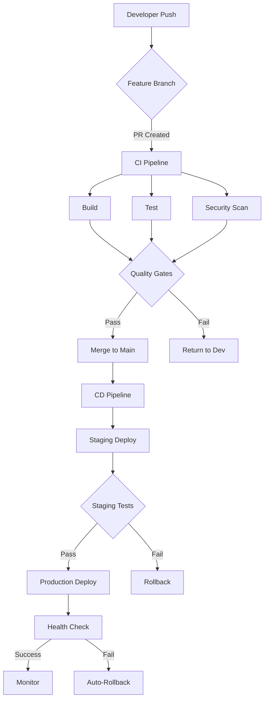

# Complete CI/CD Pipeline with GitHub Actions Guide

## Table of Contents
- [1. CI/CD Pipeline Overview](#1-cicd-pipeline-overview)
- [2. GitHub Repository Setup](#2-github-repository-setup)
- [3. GitHub Actions Fundamentals](#3-github-actions-fundamentals)
- [4. Building CI Pipeline](#4-building-ci-pipeline)
- [5. Implementing CD Pipeline](#5-implementing-cd-pipeline)
- [6. Advanced Features](#6-advanced-features)
- [7. Monitoring and Debugging](#7-monitoring-and-debugging)
- [8. Security Best Practices](#8-security-best-practices)
- [9. Version Control and Documentation](#9-version-control-and-documentation)
- [10. Best Practices and Tips](#10-best-practices-and-tips)

## 1. CI/CD Pipeline Overview

### Understanding CI/CD Stages

1. **Build Stage**
   - Compiles code and optimizes build artifacts
   - Manages dependency resolution and version conflicts
   - Implements build caching strategies
   - Performs static code analysis
   - Generates build reports and metrics
   - Handles multi-platform builds

2. **Test Stage**
   - Executes unit tests with detailed reporting
   - Performs integration testing across services
   - Conducts end-to-end testing scenarios
   - Measures code coverage and quality metrics
   - Implements performance testing
   - Validates security compliance
   - Performs load testing when necessary

3. **Deploy Stage**
   - Manages environment-specific configurations
   - Implements blue-green deployment strategies
   - Handles database migrations
   - Performs health checks post-deployment
   - Implements automated rollback procedures
   - Manages service discovery updates
   - Handles SSL/TLS certificate updates

### CI/CD Benefits in Modern Development

| Aspect | Benefit | Example | Impact Metrics |
|--------|---------|---------|----------------|
| Collaboration | Enhanced team workflow | Automatic code reviews and test feedback | 40% reduction in code review time |
| Speed | Faster development cycles | Automated builds and deployments | 60% faster release cycles |
| Quality | Consistent testing | Automated test suites run on every change | 70% reduction in production bugs |
| Adaptability | Quick market response | Rapid deployment of features and fixes | 50% faster time-to-market |
| Cost | Resource optimization | Automated resource cleanup | 30% reduction in cloud costs |
| Security | Automated security scanning | Vulnerability detection in dependencies | 80% faster security patch deployment |

### Advanced CI/CD Architecture



### Environment Strategy

| Environment | Purpose | Deployment Strategy | Access Control |
|-------------|---------|---------------------|----------------|
| Development | Feature testing | Automatic on PR | Developer team |
| Integration | Service testing | Daily builds | QA team |
| Staging | Pre-production | On main branch merge | Product team |
| Production | Live system | Manual approval | Operations team |

## 2. GitHub Repository Setup

### Advanced Repository Configuration

1. **Branch Protection Rules**
```yaml
protected_branches:
  main:
    required_status_checks:
      strict: true
      contexts:
        - "CI Tests"
        - "Security Scan"
    enforce_admins: true
    required_pull_request_reviews:
      dismissal_restrictions:
        users: ["lead-dev"]
      required_approving_review_count: 2
    restrictions:
      apps: ["github-actions"]
```

2. **Issue Templates**
```yaml
name: Bug Report
description: File a bug report
body:
  - type: markdown
    attributes:
      value: Thanks for taking the time to fill out this bug report!
  - type: input
    id: version
    attributes:
      label: Version
      description: What version of our software are you running?
    validations:
      required: true
  - type: textarea
    id: what-happened
    attributes:
      label: What happened?
      description: Also tell us, what did you expect to happen?
    validations:
      required: true
```

### Advanced Git Workflows

```bash
# Feature Branch Workflow
git checkout -b feature/ABC-123-new-feature
git add .
git commit -m "feat(module): implement new feature

- Added new API endpoint
- Updated documentation
- Added unit tests

Closes #123"

# Rebasing and Squashing
git checkout feature/ABC-123-new-feature
git rebase -i main
git push --force-with-lease

# Managing Tags
git tag -a v1.2.3 -m "Release version 1.2.3"
git push origin v1.2.3

# Cherry-picking
git cherry-pick abc123def
```

## 3. GitHub Actions Fundamentals

### Components Overview

1. **Workflows**
   - YAML files in `.github/workflows/`
   - Define automation processes
   - Triggered by events

2. **Jobs**
   - Collections of steps
   - Run in isolated environments
   - Can run in parallel

3. **Steps**
   - Individual tasks
   - Actions or shell commands
   - Sequential execution

4. **Actions**
   - Reusable workflow components
   - Available in GitHub Marketplace
   - Custom actions possible

### Basic Workflow Structure

```yaml
name: Basic CI Pipeline

on:
  push:
    branches: [ main, develop ]
  pull_request:
    branches: [ main ]

jobs:
  build-and-test:
    runs-on: ubuntu-latest
    
    steps:
      - name: Checkout repository
        uses: actions/checkout@v2

      - name: Setup Node.js
        uses: actions/setup-node@v2
        with:
          node-version: '16'
          cache: 'npm'

      - name: Install dependencies
        run: npm ci

      - name: Run tests
        run: npm test
```

## 4. Building CI Pipeline

### Setting Up Dependencies

#### Node.js Project
```yaml
steps:
  - name: Setup Node.js
    uses: actions/setup-node@v2
    with:
      node-version: '16'
      cache: 'npm'

  - name: Install dependencies
    run: npm ci
```

#### Python Project
```yaml
steps:
  - name: Setup Python
    uses: actions/setup-python@v2
    with:
      python-version: '3.9'
      cache: 'pip'

  - name: Install dependencies
    run: |
      python -m pip install --upgrade pip
      pip install -r requirements.txt
```

#### Java Project
```yaml
steps:
  - name: Setup Java
    uses: actions/setup-java@v2
    with:
      distribution: 'adopt'
      java-version: '11'
      cache: 'maven'

  - name: Build with Maven
    run: mvn -B package
```

### Running Tests

#### Unit Tests
```yaml
steps:
  - name: Run unit tests
    run: npm test
    env:
      CI: true

  - name: Store test results
    uses: actions/upload-artifact@v2
    with:
      name: test-results
      path: coverage/
```

#### Integration Tests
```yaml
steps:
  - name: Setup test database
    run: |
      docker-compose up -d database
      npm run migrate

  - name: Run integration tests
    run: npm run test:integration
```

### Code Quality Checks

#### Linting
```yaml
steps:
  - name: Lint JavaScript
    run: |
      npm run lint
      npm run lint:style

  - name: Lint Python
    run: |
      pip install pylint
      pylint **/*.py
```

#### Code Coverage
```yaml
steps:
  - name: Run tests with coverage
    run: npm test -- --coverage

  - name: Upload to Codecov
    uses: codecov/codecov-action@v2
    with:
      token: ${{ secrets.CODECOV_TOKEN }}
```

## 5. Implementing CD Pipeline

### Environment Setup

```yaml
name: Deployment Pipeline

on:
  push:
    branches: [ main ]

jobs:
  deploy:
    runs-on: ubuntu-latest
    environment: production
    
    steps:
      - name: Configure AWS credentials
        uses: aws-actions/configure-aws-credentials@v1
        with:
          aws-access-key-id: ${{ secrets.AWS_ACCESS_KEY_ID }}
          aws-secret-access-key: ${{ secrets.AWS_SECRET_ACCESS_KEY }}
          aws-region: us-east-1
```

### Deployment Examples

#### AWS Deployment
```yaml
steps:
  - name: Deploy to AWS
    run: |
      aws s3 sync ./build s3://${{ secrets.S3_BUCKET }}
      aws cloudfront create-invalidation --distribution-id ${{ secrets.CF_DIST_ID }}
```

#### Heroku Deployment
```yaml
steps:
  - name: Deploy to Heroku
    uses: akhileshns/heroku-deploy@v3.12.12
    with:
      heroku_api_key: ${{ secrets.HEROKU_API_KEY }}
      heroku_app_name: ${{ secrets.HEROKU_APP_NAME }}
      heroku_email: ${{ secrets.HEROKU_EMAIL }}
```

### Rollback Strategy

```yaml
jobs:
  deploy:
    steps:
      - name: Deploy
        id: deploy
        run: ./deploy.sh

      - name: Rollback on failure
        if: failure() && steps.deploy.outcome == 'failure'
        run: |
          echo "Deployment failed, initiating rollback..."
          ./rollback.sh
```

## 6. Advanced Features

### Matrix Builds

```yaml
jobs:
  test:
    runs-on: ${{ matrix.os }}
    strategy:
      matrix:
        os: [ubuntu-latest, windows-latest, macos-latest]
        node-version: [14.x, 16.x, 18.x]
        
    steps:
      - uses: actions/checkout@v2
      - name: Use Node.js ${{ matrix.node-version }}
        uses: actions/setup-node@v2
        with:
          node-version: ${{ matrix.node-version }}
```

### Caching

```yaml
steps:
  - name: Cache dependencies
    uses: actions/cache@v2
    with:
      path: |
        ~/.npm
        node_modules
      key: ${{ runner.os }}-node-${{ hashFiles('**/package-lock.json') }}
      restore-keys: |
        ${{ runner.os }}-node-
```

### Artifacts

```yaml
steps:
  - name: Build
    run: npm run build

  - name: Upload build artifacts
    uses: actions/upload-artifact@v2
    with:
      name: build-files
      path: dist/
      retention-days: 5
```

## 7. Monitoring and Debugging

### Debug Logging

```yaml
steps:
  - name: Enable debug logging
    env:
      ACTIONS_RUNNER_DEBUG: true
      ACTIONS_STEP_DEBUG: true
    run: |
      echo "Debug mode enabled"
      echo "Current directory: $PWD"
      echo "GitHub workspace: $GITHUB_WORKSPACE"
```

### Error Handling

```yaml
steps:
  - name: Run with error handling
    continue-on-error: true
    run: |
      set -e
      npm run risky-command || echo "Command failed but continuing..."
```

## 8. Security Best Practices

### Secrets Management

```yaml
jobs:
  deploy:
    steps:
      - name: Use secrets securely
        env:
          API_TOKEN: ${{ secrets.API_TOKEN }}
        run: |
          echo "Using secured API token"
          curl -H "Authorization: Bearer $API_TOKEN" https://api.example.com
```

### Security Scanning

```yaml
steps:
  - name: Security scan
    uses: snyk/actions/node@master
    env:
      SNYK_TOKEN: ${{ secrets.SNYK_TOKEN }}
    with:
      args: --severity-threshold=high
```

## 9. Version Control and Documentation

### Automated Releases

```yaml
name: Create Release

on:
  push:
    tags:
      - 'v*'

jobs:
  release:
    runs-on: ubuntu-latest
    steps:
      - name: Create Release
        uses: actions/create-release@v1
        env:
          GITHUB_TOKEN: ${{ secrets.GITHUB_TOKEN }}
        with:
          tag_name: ${{ github.ref }}
          release_name: Release ${{ github.ref }}
          draft: false
          prerelease: false
```

### Automated Changelog

```yaml
steps:
  - name: Generate changelog
    uses: github-changelog-generator/github-changelog-generator@v1
    with:
      token: ${{ secrets.GITHUB_TOKEN }}
      output: CHANGELOG.md
```

## 10. Best Practices and Tips

### Workflow Optimization

1. **Use Specific Triggers**
```yaml
on:
  push:
    paths:
      - 'src/**'
      - 'test/**'
    branches:
      - main
```

2. **Job Dependencies**
```yaml
jobs:
  test:
    runs-on: ubuntu-latest
    
  deploy:
    needs: test
    runs-on: ubuntu-latest
    if: github.ref == 'refs/heads/main'
```

### Performance Tips

1. **Minimize Actions**
   - Use composite actions
   - Combine similar steps
   - Cache dependencies

2. **Optimize Triggers**
   - Use path filters
   - Implement skip conditions
   - Use appropriate events

### Workflow Examples

#### Complete Production Deployment
```yaml
name: Production Deployment

on:
  push:
    branches: [ main ]

jobs:
  deploy:
    runs-on: ubuntu-latest
    environment: production
    
    steps:
      - uses: actions/checkout@v2
      
      - name: Setup Node.js
        uses: actions/setup-node@v2
        with:
          node-version: '16'
          cache: 'npm'
      
      - name: Install dependencies
        run: npm ci
      
      - name: Run tests
        run: npm test
      
      - name: Build
        run: npm run build
      
      - name: Deploy to AWS
        uses: aws-actions/configure-aws-credentials@v1
        with:
          aws-access-key-id: ${{ secrets.AWS_ACCESS_KEY_ID }}
          aws-secret-access-key: ${{ secrets.AWS_SECRET_ACCESS_KEY }}
          aws-region: us-east-1
      
      - name: Upload to S3
        run: aws s3 sync ./build s3://${{ secrets.S3_BUCKET }}
      
      - name: Invalidate CloudFront
        run: |
          aws cloudfront create-invalidation \
            --distribution-id ${{ secrets.CF_DIST_ID }} \
            --paths "/*"
```

---

## Additional Resources

- [GitHub Actions Documentation](https://docs.github.com/en/actions)
- [GitHub Actions Marketplace](https://github.com/marketplace?type=actions)
- [GitHub Actions Community Forum](https://github.community/c/actions)
- [Awesome GitHub Actions](https://github.com/sdras/awesome-actions)
